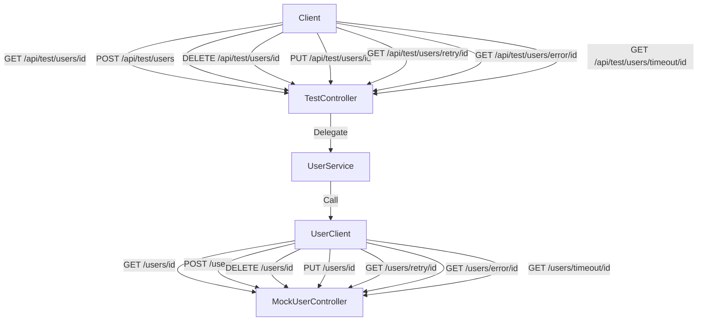

# HttpInterface 예제 코드

## HttpInterface 코드

```kotlin
@HttpExchange
interface UserClient {
    @GetExchange("/users/{id}")
    fun getUser(@PathVariable id: Long): User

    @PostExchange("/users")
    fun createUser(@RequestBody user: User): User

    @Retryable(
        include = [RuntimeException::class],
        maxAttempts = 3,
        backoff = Backoff(delay = 1000)
    )
    @GetExchange("/users/retry/{id}")
    fun getUserWithRetry(
        @PathVariable id: Long,
        @RequestParam("failCount", required = false) failCount: Int?
    ): User

    @GetExchange("/users/error/{id}")
    fun getUserWithError(
        @PathVariable id: Long,
        @RequestParam("errorType") errorType: String
    ): User

    @DeleteExchange("/users/{id}")
    fun deleteUser(@PathVariable id: Long)

    @PutExchange("/users/{id}")
    fun updateUser(
        @PathVariable id: Long,
        @RequestBody user: User
    ): User

    @GetExchange("/users/timeout/{id}")
    fun getUserWithTimeout(
        @PathVariable id: Long,
        @RequestParam("delayMs") delayMs: Long
    ): User
}
```

## HttpInterface 설정 코드

```kotlin
@Configuration
class HttpInterfaceConfig(
    @Value("\${rest.client.base-url}")
    private val baseUrl: String
) {

    @Bean
    fun userClient(restClientBuilder: RestClient.Builder): UserClient {
        // RestClient 생성 및 기본 설정
        val restClient = restClientBuilder
            .baseUrl(baseUrl)
            .build()

        // RestClient를 HTTP Interface에 연결
        val adapter = RestClientAdapter.create(restClient)
        val factory = HttpServiceProxyFactory.builderFor(adapter)
            .build()

        return factory.createClient(UserClient::class.java)
    }
}

@Configuration
class RestClientConfig(
    @Value("\${rest.client.base-url}")
    private val baseUrl: String
) {

    companion object {

        private val logger = LoggerFactory.getLogger(RestClientConfig::class.java)
    }

    @Bean
    fun defaultRestClientBuilder(): RestClient.Builder {
        return RestClient
            .builder()
            .baseUrl(baseUrl)
            .defaultHeaders { headers ->
                headers.setBearerAuth(generateToken())
            }
            .requestInterceptor { request, body, execution ->
                logger.debug("Request: {} {}", request.method, request.uri)
                execution.execute(request, body)
            }
            .requestInterceptor(LoggingInterceptor())
            .defaultStatusHandler(HttpStatusCode::isError) { _, response ->
                when (response.statusCode) {
                    HttpStatus.NOT_FOUND -> throw RestClientException("Resource not found")
                    HttpStatus.UNAUTHORIZED -> throw RestClientException("Unauthorized")
                    HttpStatus.BAD_REQUEST -> throw RestClientException("Invalid request")
                    else -> throw RestClientException("HTTP error: ${response.statusCode}")
                }
            }
    }

    // 상세 로깅을 위한 인터셉터 구현
    class LoggingInterceptor : ClientHttpRequestInterceptor {

        override fun intercept(
            request: HttpRequest,
            body: ByteArray,
            execution: ClientHttpRequestExecution
        ): ClientHttpResponse {
            logger.info("=== Request ===")
            logger.info("URI: {}", request.uri)
            logger.info("Method: {}", request.method)
            logger.info("Headers: {}", request.headers)

            val response = execution.execute(request, body)

            logger.info("=== Response ===")
            logger.info("Status: {}", response.statusCode)

            return response
        }

        companion object {

            private val logger = LoggerFactory.getLogger(LoggingInterceptor::class.java)
        }
    }

    private fun generateToken(): String {
        return "token"
    }

}
```

## API 목록

### 테스트 가능한 API

- **GET /api/test/users/{id}**: 특정 사용자를 조회합니다.
- **POST /api/test/users**: 새로운 사용자를 생성합니다.
- **DELETE /api/test/users/{id}**: 특정 사용자를 삭제합니다.
- **PUT /api/test/users/{id}**: 특정 사용자를 업데이트합니다.
- **GET /api/test/users/retry/{id}**: 재시도 로직을 테스트합니다.
- **GET /api/test/users/error/{id}**: 에러 케이스를 테스트합니다.
- **GET /api/test/users/timeout/{id}**: 타임아웃을 테스트합니다.

### Http Interface의 요청을 받는 모의 API

- **GET /users/{id}**: 특정 사용자를 조회합니다.
- **POST /users**: 새로운 사용자를 생성합니다.
- **DELETE /users/{id}**: 특정 사용자를 삭제합니다.
- **PUT /users/{id}**: 특정 사용자를 업데이트합니다.
- **GET /users/retry/{id}**: 재시도 로직을 테스트합니다.
- **GET /users/error/{id}**: 에러 케이스를 테스트합니다.
- **GET /users/timeout/{id}**: 타임아웃을 테스트합니다.
- **POST /users/reset**: 테스트 데이터를 초기화합니다.
- **POST /users/sample-data**: 샘플 데이터를 생성합니다.



